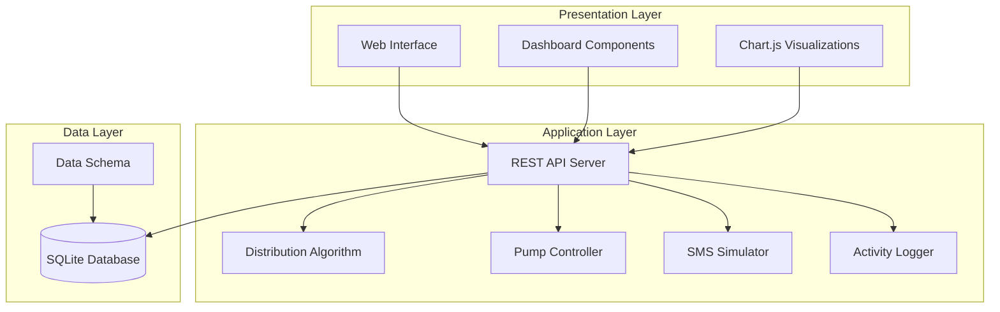

# MajiSafe Water Infrastructure Management Platform - Design Document

## Overview

MajiSafe is a smart water infrastructure management platform designed to help NGOs and governments monitor and manage rural water systems efficiently. The platform provides real-time monitoring of water distribution, community demand tracking, and automated pump control through a unified web-based dashboard.

### Core Objectives

- **Real-time Monitoring**: Provide comprehensive visibility into water system performance and status
- **Demand-driven Distribution**: Allocate water resources based on actual community needs
- **Remote Management**: Enable pump control and system management from a central interface
- **Impact Measurement**: Track and report on water distribution effectiveness
- **Demonstration Ready**: Support local development and demo scenarios with simulated data

### Key Features

- Water infrastructure dashboard with key metrics
- Community demand monitoring with visual comparisons
- Smart water distribution algorithm based on demand ratios
- Remote pump control with status tracking
- Water flow estimation and accumulation
- SMS request simulation for demonstration
- Impact measurement and reporting
- System topology visualization
- Comprehensive activity logging
- Local development environment with SQLite

## Architecture

### System Architecture

The MajiSafe platform follows a three-tier web architecture:



### Technology Stack

- **Backend**: Python with Flask/FastAPI framework
- **Database**: SQLite for local development and demonstration
- **Frontend**: HTML5, CSS3, JavaScript with Chart.js
- **Real-time Updates**: WebSocket or Server-Sent Events for live data
- **Development**: Local laptop deployment with simple setup

### Deployment Model

The platform is designed for local development and demonstration:
- Single-machine deployment on laptop
- No external dependencies or cloud services required
- Self-contained with embedded database
- Simple startup process for demos and development

## Components and Interfaces

### Core Components

#### 1. Water Dashboard Component
**Purpose**: Central monitoring interface displaying key system metrics

**Responsibilities**:
- Display total water distributed (liters/day)
- Show current water request count
- Display number of communities served
- Show pump status indicators (ON/OFF)
- Present metrics as visual cards

**Interfaces**:
- `GET /api/dashboard/metrics` - Retrieve current dashboard data
- `WebSocket /ws/dashboard` - Real-time metric updates

#### 2. Community Demand Monitor
**Purpose**: Track and visualize water requests from villages

**Responsibilities**:
- Monitor Village A water requests
- Monitor Village B water requests
- Generate demand comparison charts
- Provide real-time demand updates

**Interfaces**:
- `GET /api/demand/villages` - Get demand data for all villages
- `GET /api/demand/village/{id}` - Get specific village demand
- `WebSocket /ws/demand` - Real-time demand updates

#### 3. Smart Distribution Algorithm
**Purpose**: Calculate optimal water allocation based on community demand

**Responsibilities**:
- Calculate allocation ratios based on demand
- Log distribution decisions
- Prioritize high-demand villages
- Provide allocation recommendations

**Interfaces**:
- `POST /api/distribution/calculate` - Calculate new distribution
- `GET /api/distribution/current` - Get current allocation
- `GET /api/distribution/history` - Get allocation history

#### 4. Pump Controller
**Purpose**: Manage water pump operations and status

**Responsibilities**:
- Control Village A pump (start/stop)
- Control Village B pump (start/stop)
- Track pump runtime duration
- Monitor pump status

**Interfaces**:
- `POST /api/pumps/{pump_id}/start` - Start specific pump
- `POST /api/pumps/{pump_id}/stop` - Stop specific pump
- `GET /api/pumps/status` - Get all pump statuses
- `GET /api/pumps/{pump_id}/runtime` - Get pump runtime

#### 5. Water Flow Estimator
**Purpose**: Calculate and track water distribution amounts

**Responsibilities**:
- Simulate 20L/min flow rate per pump
- Calculate accumulated water distributed
- Update estimates every minute
- Track per-village distribution

**Interfaces**:
- `GET /api/water/flow/current` - Current flow rates
- `GET /api/water/distributed/total` - Total water distributed
- `GET /api/water/distributed/village/{id}` - Village-specific amounts

#### 6. SMS Simulator
**Purpose**: Simulate SMS-based water requests for demonstration

**Responsibilities**:
- Generate Village A requests
- Generate Village B requests
- Increment demand counters
- Trigger demand monitor updates

**Interfaces**:
- `POST /api/sms/request/village-a` - Simulate Village A request
- `POST /api/sms/request/village-b` - Simulate Village B request
- `GET /api/sms/requests/history` - Get request history

#### 7. Impact Tracker
**Purpose**: Measure and report platform effectiveness

**Responsibilities**:
- Calculate total water distributed
- Estimate people served (20L/person/day)
- Count communities served
- Provide real-time impact metrics

**Interfaces**:
- `GET /api/impact/metrics` - Get current impact data
- `GET /api/impact/people-served` - Get people served estimate
- `GET /api/impact/communities` - Get communities count

#### 8. System Map Visualizer
**Purpose**: Display water infrastructure topology and status

**Responsibilities**:
- Show village locations
- Display pump positions
- Indicate pump status with colors
- Show water tank connections

**Interfaces**:
- `GET /api/map/topology` - Get system topology data
- `GET /api/map/status` - Get current system status
- `WebSocket /ws/map` - Real-time status updates

#### 9. Activity Logger
**Purpose**: Track and display system activity history

**Responsibilities**:
- Log pump start/stop events
- Log distribution decisions
- Log SMS request events
- Display chronological timeline
- Limit to 50 recent events

**Interfaces**:
- `GET /api/activity/log` - Get recent activity log
- `POST /api/activity/log` - Add new activity entry
- `GET /api/activity/log/filtered` - Get filtered activity

### Interface Specifications

#### REST API Endpoints

**Dashboard Endpoints**:
```
GET /api/dashboard/metrics
Response: {
  "total_water_distributed": number,
  "current_requests": number,
  "communities_served": number,
  "pump_statuses": [
    {"pump_id": string, "status": "ON"|"OFF", "village": string}
  ]
}
```

**Pump Control Endpoints**:
```
POST /api/pumps/{pump_id}/start
Response: {"status": "success", "pump_id": string, "new_status": "ON"}

POST /api/pumps/{pump_id}/stop
Response: {"status": "success", "pump_id": string, "new_status": "OFF"}
```

**Demand Monitoring Endpoints**:
```
GET /api/demand/villages
Response: {
  "village_a": {"requests": number, "last_updated": timestamp},
  "village_b": {"requests": number, "last_updated": timestamp}
}
```

#### WebSocket Events

**Real-time Dashboard Updates**:
```
Event: dashboard_update
Data: {
  "type": "metrics_update",
  "data": {dashboard_metrics_object}
}
```

**Pump Status Changes**:
```
Event: pump_status_change
Data: {
  "pump_id": string,
  "status": "ON"|"OFF",
  "timestamp": timestamp
}
```

## Data Models

### Database Schema

#### Villages Table
```sql
CREATE TABLE villages (
    id INTEGER PRIMARY KEY,
    name VARCHAR(50) NOT NULL,
    current_demand INTEGER DEFAULT 0,
    total_requests INTEGER DEFAULT 0,
    created_at TIMESTAMP DEFAULT CURRENT_TIMESTAMP
);
```

#### Pumps Table
```sql
CREATE TABLE pumps (
    id INTEGER PRIMARY KEY,
    village_id INTEGER,
    status VARCHAR(10) DEFAULT 'OFF',
    runtime_minutes INTEGER DEFAULT 0,
    last_started TIMESTAMP,
    last_stopped TIMESTAMP,
    FOREIGN KEY (village_id) REFERENCES villages(id)
);
```

#### Water Distribution Records Table
```sql
CREATE TABLE water_distribution (
    id INTEGER PRIMARY KEY,
    village_id INTEGER,
    amount_liters DECIMAL(10,2),
    distribution_timestamp TIMESTAMP DEFAULT CURRENT_TIMESTAMP,
    allocation_ratio DECIMAL(5,4),
    FOREIGN KEY (village_id) REFERENCES villages(id)
);
```

#### Activity Log Table
```sql
CREATE TABLE activity_log (
    id INTEGER PRIMARY KEY,
    event_type VARCHAR(50),
    description TEXT,
    village_id INTEGER,
    pump_id INTEGER,
    timestamp TIMESTAMP DEFAULT CURRENT_TIMESTAMP,
    metadata JSON,
    FOREIGN KEY (village_id) REFERENCES villages(id),
    FOREIGN KEY (pump_id) REFERENCES pumps(id)
);
```

#### SMS Requests Table
```sql
CREATE TABLE sms_requests (
    id INTEGER PRIMARY KEY,
    village_id INTEGER,
    request_timestamp TIMESTAMP DEFAULT CURRENT_TIMESTAMP,
    simulated BOOLEAN DEFAULT TRUE,
    FOREIGN KEY (village_id) REFERENCES villages(id)
);
```

### Data Models

#### Village Model
```python
class Village:
    id: int
    name: str
    current_demand: int
    total_requests: int
    created_at: datetime
    
    def add_request(self) -> None
    def get_demand_ratio(self, total_demand: int) -> float
```

#### Pump Model
```python
class Pump:
    id: int
    village_id: int
    status: str  # 'ON' or 'OFF'
    runtime_minutes: int
    last_started: datetime
    last_stopped: datetime
    
    def start(self) -> bool
    def stop(self) -> bool
    def get_current_runtime(self) -> int
    def calculate_water_distributed(self) -> float
```

#### WaterDistribution Model
```python
class WaterDistribution:
    id: int
    village_id: int
    amount_liters: float
    distribution_timestamp: datetime
    allocation_ratio: float
    
    @staticmethod
    def calculate_allocation(villages: List[Village]) -> Dict[int, float]
```

#### ActivityLogEntry Model
```python
class ActivityLogEntry:
    id: int
    event_type: str
    description: str
    village_id: Optional[int]
    pump_id: Optional[int]
    timestamp: datetime
    metadata: Dict
    
    @staticmethod
    def log_pump_event(pump_id: int, action: str) -> None
    @staticmethod
    def log_distribution_event(village_id: int, amount: float) -> None
```

### Sample Data

The system will initialize with the following sample data:

**Villages**:
- Village A: Initial demand = 5 requests
- Village B: Initial demand = 3 requests

**Pumps**:
- Pump 1: Associated with Village A, Status = OFF
- Pump 2: Associated with Village B, Status = OFF

**Initial Activity Log**:
- System startup event
- Sample distribution calculation
- Sample SMS requests for both villages

## Correctness Properties

*A property is a characteristic or behavior that should hold true across all valid executions of a system-essentially, a formal statement about what the system should do. Properties serve as the bridge between human-readable specifications and machine-verifiable correctness guarantees.*

### Property 1: Dashboard Metrics Display

*For any* system state, the Water Dashboard should display all required metrics including total water distributed in liters, current request count, communities served count, and pump statuses with clear labels in card format.

**Validates: Requirements 1.1, 1.2, 1.3, 1.4, 1.5**

### Property 2: Village Demand Tracking

*For any* water request from either village, the Community Demand Monitor should accurately track and record the request for the correct village.

**Validates: Requirements 2.1, 2.2**

### Property 3: Real-time Demand Updates

*For any* change in demand data, the Community Demand Monitor should update the bar chart display immediately to reflect the new state.

**Validates: Requirements 2.3, 2.4**

### Property 4: Distribution Calculation Accuracy

*For any* set of village demand ratios, the Smart Distribution Algorithm should calculate water allocation proportional to those ratios and prioritize villages with higher demand.

**Validates: Requirements 3.1, 3.4**

### Property 5: Distribution Decision Logging

*For any* distribution decision made by the algorithm, the system should log the allocation amounts and display current decisions on the dashboard.

**Validates: Requirements 3.2, 3.3**

### Property 6: Pump Control Operations

*For any* pump start or stop command, the Pump Controller should correctly activate or deactivate the corresponding pump and update the status display.

**Validates: Requirements 4.3, 4.4**

### Property 7: Pump Runtime Tracking

*For any* active pump, the Pump Controller should accurately track and display the runtime duration.

**Validates: Requirements 4.5**

### Property 8: Water Flow Simulation

*For any* active pump, the system should simulate water flow at exactly 20 liters per minute and calculate accumulated distribution correctly.

**Validates: Requirements 5.1, 5.2**

### Property 9: Water Estimate Updates

*For any* running pump, the system should update water distribution estimates every minute and display per-village amounts on the dashboard.

**Validates: Requirements 5.3, 5.4**

### Property 10: SMS Request Simulation

*For any* SMS request button click, the SMS Simulator should increment the correct village's demand count and update the Community Demand Monitor.

**Validates: Requirements 6.1, 6.2, 6.3, 6.4**

### Property 11: Impact Metrics Calculation

*For any* water distribution event, the Impact Tracker should correctly calculate total water distributed, estimate people served using 20L/person/day, and update metrics in real-time.

**Validates: Requirements 7.1, 7.2, 7.4**

### Property 12: Communities Served Count

*For any* system state, the Impact Tracker should display the accurate count of communities currently being served.

**Validates: Requirements 7.3**

### Property 13: System Map Visualization

*For any* system state, the platform should display a complete diagram showing both village locations, pump locations, pump status with correct color indicators (green for active, red for inactive), and the shared water tank connection.

**Validates: Requirements 8.1, 8.2, 8.3, 8.4**

### Property 14: Comprehensive Event Logging

*For any* system event (pump start/stop, distribution decision, SMS request), the platform should log the event with accurate timestamps, amounts where applicable, and village information.

**Validates: Requirements 9.1, 9.2, 9.3**

### Property 15: Activity Log Display

*For any* activity log query, the system should display events in chronological order and limit the display to the most recent 50 events.

**Validates: Requirements 9.4, 9.5**

### Property 16: Database Technology Usage

*For any* data persistence operation, the platform should use SQLite database for local storage.

**Validates: Requirements 10.2**

### Property 17: Sample Data Initialization

*For any* fresh database initialization, the platform should include sample test data for both Village A and Village B.

**Validates: Requirements 10.4, 11.5**

### Property 18: Data Persistence Completeness

*For any* data entity (village, pump, distribution record, activity log), the system should store all required fields including names, statuses, timestamps, amounts, and associations as specified in the schema.

**Validates: Requirements 11.1, 11.2, 11.3, 11.4**

### Property 19: UI Technology Standards

*For any* user interface element, the platform should use card-based layout for metrics, Chart.js for demand comparison charts, and appropriate color indicators for status display.

**Validates: Requirements 12.1, 12.2, 12.3**

### Property 20: Responsive Design Compatibility

*For any* laptop screen size, the platform should provide responsive design that works properly on the target screen dimensions.

**Validates: Requirements 12.4**

## Error Handling

### Error Categories

#### 1. Database Connection Errors
- **Scenario**: SQLite database file corruption or access issues
- **Handling**: Graceful degradation with in-memory fallback, error logging, user notification
- **Recovery**: Automatic database recreation with sample data

#### 2. Pump Control Errors
- **Scenario**: Pump fails to start/stop, communication timeout
- **Handling**: Retry mechanism with exponential backoff, status verification, error logging
- **Recovery**: Manual override capability, status reconciliation

#### 3. Real-time Update Failures
- **Scenario**: WebSocket connection drops, server-sent events fail
- **Handling**: Automatic reconnection, fallback to polling, connection status indicator
- **Recovery**: Seamless reconnection with state synchronization

#### 4. Data Validation Errors
- **Scenario**: Invalid input data, constraint violations
- **Handling**: Input sanitization, validation feedback, data integrity checks
- **Recovery**: Reject invalid operations, maintain system consistency

#### 5. Resource Exhaustion
- **Scenario**: Memory limits, disk space, concurrent connections
- **Handling**: Resource monitoring, graceful degradation, cleanup procedures
- **Recovery**: Automatic resource management, system restart if needed

### Error Response Patterns

#### API Error Responses
```json
{
  "error": {
    "code": "PUMP_CONTROL_FAILED",
    "message": "Failed to start pump for Village A",
    "details": {
      "pump_id": "pump_1",
      "attempted_action": "start",
      "timestamp": "2024-01-15T10:30:00Z"
    },
    "retry_after": 30
  }
}
```

#### Frontend Error Handling
- Toast notifications for user-facing errors
- Loading states during operations
- Fallback content for failed data loads
- Retry buttons for recoverable errors

#### Logging Strategy
- Structured logging with JSON format
- Error severity levels (DEBUG, INFO, WARN, ERROR, CRITICAL)
- Correlation IDs for request tracing
- Automatic log rotation and cleanup

## Testing Strategy

### Dual Testing Approach

The MajiSafe platform will employ both unit testing and property-based testing to ensure comprehensive coverage and correctness validation.

#### Unit Testing Focus
- **Specific Examples**: Test concrete scenarios like "Village A requests water, pump starts, 20L distributed"
- **Edge Cases**: Empty databases, zero demand, simultaneous pump operations
- **Integration Points**: API endpoint responses, database transactions, WebSocket connections
- **Error Conditions**: Invalid inputs, network failures, resource constraints

#### Property-Based Testing Focus
- **Universal Properties**: Test behaviors that should hold across all valid inputs
- **Comprehensive Coverage**: Generate thousands of test cases automatically
- **Correctness Validation**: Verify each design property with randomized inputs
- **Regression Prevention**: Catch edge cases that manual testing might miss

### Property-Based Testing Configuration

**Testing Library**: Hypothesis (Python) for property-based testing
**Test Iterations**: Minimum 100 iterations per property test
**Test Tagging**: Each property test must reference its design document property

**Tag Format**: `# Feature: majisafe-water-platform, Property {number}: {property_text}`

### Test Implementation Requirements

#### Property Test Examples

**Property 4 Test**:
```python
@given(village_demands=st.lists(st.integers(min_value=0, max_value=100), min_size=2, max_size=2))
def test_distribution_calculation_accuracy(village_demands):
    """
    Feature: majisafe-water-platform, Property 4: Distribution Calculation Accuracy
    For any set of village demand ratios, the Smart Distribution Algorithm should 
    calculate water allocation proportional to those ratios and prioritize villages 
    with higher demand.
    """
    # Test implementation here
```

**Property 8 Test**:
```python
@given(runtime_minutes=st.integers(min_value=1, max_value=1440))
def test_water_flow_simulation(runtime_minutes):
    """
    Feature: majisafe-water-platform, Property 8: Water Flow Simulation
    For any active pump, the system should simulate water flow at exactly 
    20 liters per minute and calculate accumulated distribution correctly.
    """
    # Test implementation here
```

#### Unit Test Categories

1. **API Endpoint Tests**: Verify correct HTTP responses and status codes
2. **Database Operation Tests**: Test CRUD operations and data integrity
3. **Component Integration Tests**: Verify component interactions work correctly
4. **UI Functionality Tests**: Test button clicks, form submissions, display updates
5. **Error Handling Tests**: Verify graceful error handling and recovery

### Test Coverage Requirements

- **Code Coverage**: Minimum 85% line coverage
- **Property Coverage**: All 20 design properties must have corresponding property tests
- **Integration Coverage**: All API endpoints and component interactions tested
- **Error Coverage**: All error scenarios and recovery paths tested

### Continuous Testing

- **Pre-commit Hooks**: Run unit tests before code commits
- **CI/CD Pipeline**: Automated test execution on code changes
- **Property Test Scheduling**: Daily property test runs with extended iterations
- **Performance Testing**: Regular performance benchmarks for key operations

The testing strategy ensures that the MajiSafe platform maintains high reliability and correctness while supporting rapid development and demonstration needs.